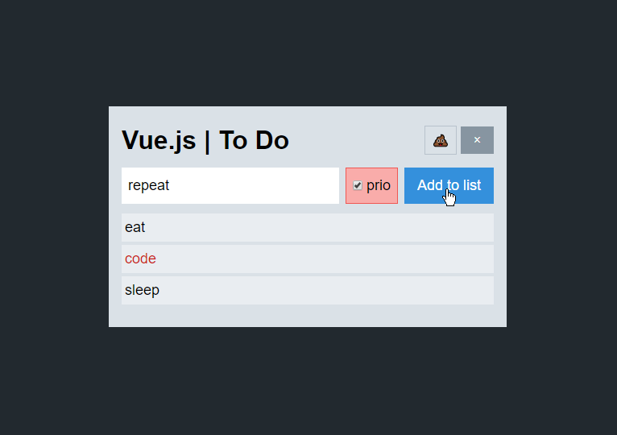

# vue-projects
a collection of small Vue.js projects

### 01 To Do List
To refresh my Vue.js knowledge, I attempt to code the To Do app I watched the instructor of yesterdays course code from memory. After initial difficulties, I got into the groove again. It took me around 2 hours.

Tech used:  
* [Vue.js](https://github.com/vuejs/vue) via CDN
* [Tailwind.css](https://github.com/tailwindcss/tailwindcss) via CDN

The user can:
* add, delete items
* delete all items

Details:
* in part functionalities are conditionally rendered (delete all, delete item on hover)
* the to do list is saved using the Local Storage of the browser

